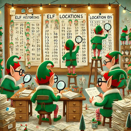

**Day 1: Historian Hysteria**



- Problem: Calculate the total distance and similarity score between two lists of location IDs.
- Solution: Sorted both lists, computed distances between paired elements for the total distance, and multiplied elements by their occurrences for the similarity score.
- Keywords: sorting, pairing, hashmap, absolute difference, frequency count.

**Day 2: Red-Nosed Reports**


- Problem : Identify reports with strictly increasing or decreasing sequences of numbers with differences between 1 and 3.
- Solution : Evaluated each report for sequence trends and applied a condition to potentially exclude one outlier to deem a report safe.
- Keywords: sequences, validation, adjacent differences, conditional checks

```
Generate an image for this problem, with a christmas and elf theme, in the style of 60s belgium comics.
```
```
Create a concise summary, single line, of the problem and solution, excluding specific numbers and complete sentences, formatted in Markdown.
Use this template:

**Day X: [Title]**

- Probem: [single line problem description.]
- Solution: [single line solution description.]
- Keywords: [algorithm specific keywords]
```

